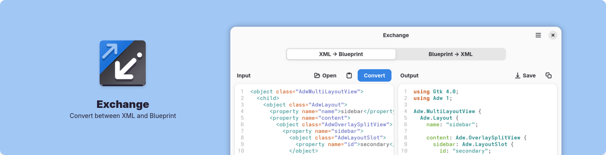

# Exchange

**Convert between XML and Blueprint**

## Description

Exchange lets you convert between GTK UI definition formats such as XML and Blueprint written in Python, using GTK4 and Libadwaita. It uses [Blueprint Compiler](https://gitlab.gnome.org/GNOME/blueprint-compiler) under the hood for conversion.

## Features

- Convert XML to Blueprint
- Convert Blueprint to XML
- Automatically detects format when pasting or opening files

## Install

## Development

You can clone this project and run it using [Gnome Builder](https://apps.gnome.org/Builder/).
